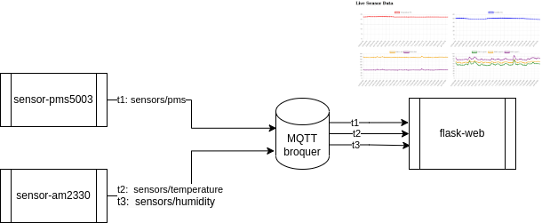
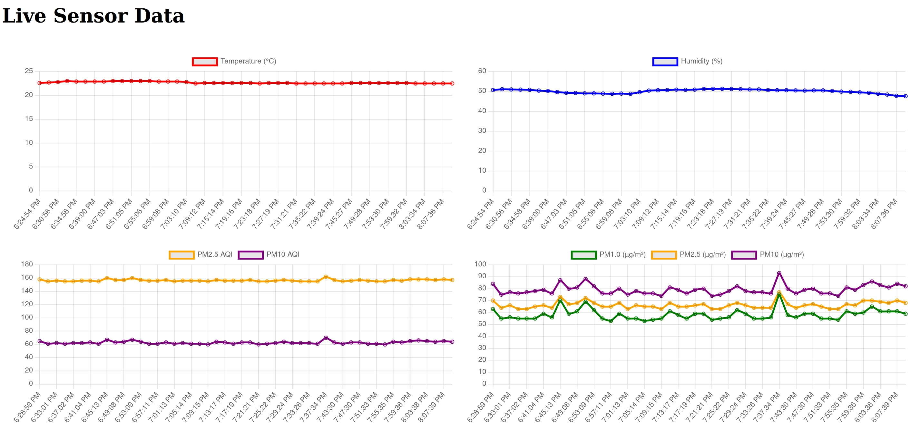
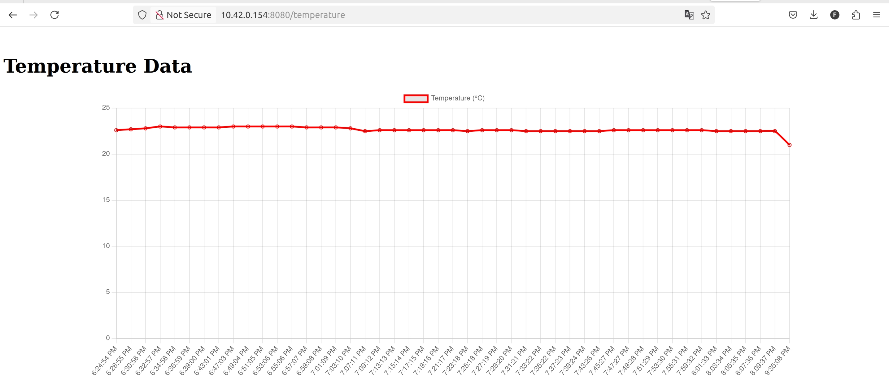
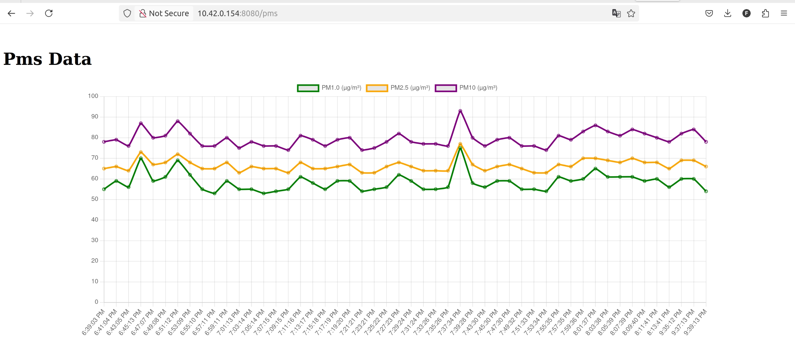

# Air Quality Embedded Linux Project

This project provides an embedded Linux solution to measure air quality using the Yocto Project (Styhead).

## How does it work ?

The system is composed of services to read the data from the sensors and another service that will subscribe to that data and and  will display it in a web page. The exchange of data is done trough an MQTT broker, as exemplified in the figure below.

 


#### Features

- Sensor integration for AM2330 (digital temperature and humidity sensor) and Plantover PMS5003 sensor (particles matter sensor)
- Web-app creation for visualization of the data from the sensors


## Getting Started

### Prerequisites

- Linux host machine

### Clone the Repository


```
git clone --recursive git@github.com:FredGomes92/air-quality-yocto.git
cd air-quality-yocto
```

### Setup and Build

Run the setup script to initialize and setup bitbake:

```
./setup.sh
```

Edit the `conf/local.conf` with the following machine and distribution info:

```
MACHINE ?= "raspberrypi4"
DISTRO ?= "air-quality"
```

Build: ```bitbake core-image-minimal ```

## Setup
 
 

 All data visualization:

 

 Individual data visualization:

<table>
  <tr>
    <td></td>
    <td></td>
  </tr>
</table>


